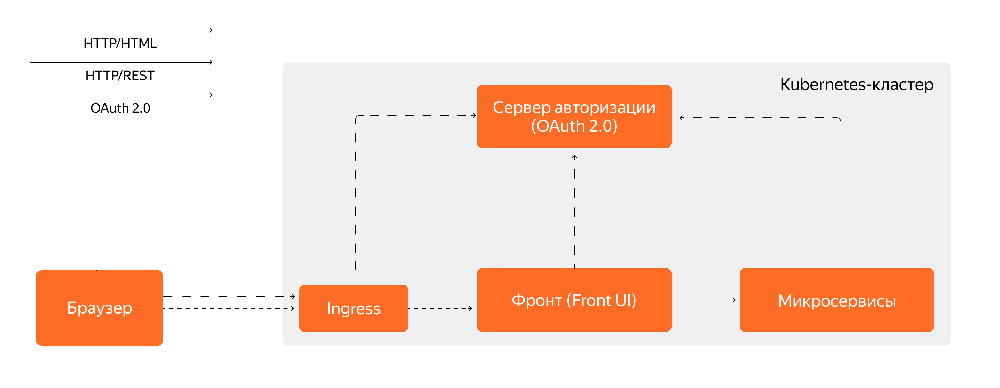

# Приложение «Мой Банк» (My Bank)

Микросервисное банковское приложение на Java 21 с использованием Spring Boot.  
Поддерживает функционал управления аккаунтами, пополнения/снятия средств, переводов между счетами и уведомлений.

## Структура проекта

Приложение состоит из следующих микросервисов:
- **front** — фронтенд с веб-интерфейсом, реализованным с помощью Spring Web MVC и Thymeleaf.
- **accounts** — микросервис для управления аккаунтами и счетами пользователей.
- **cash** — микросервис для внесения и снятия средств со счетов.
- **transfer** — микросервис для перевода средств между счетами пользователей.
- **notifications** — микросервис отправки уведомлений (логирование).

А также компонентов инфраструктуры:
- **keycloak** — сервер авторизации OAuth 2.0 для аутентификации пользователей и межсервисной авторизации.
- **postgres** — база данных.

## Требования

- Java 21
- PostgreSQL 17+
- Keycloak 26.3+
- Maven 3.6+
- Docker Engine 28.3+
- Minikube 1.37+
- Helm 3.16+
- Jenkins 2.528+

## Конфигурация

### PostgreSQL
Используется один экземпляр PostgreSQL с базой данных `my_bank`. Для микросервисов разделены схемы согласно паттерну Database per Service.  
Параметры подключения задаются через переменные окружения:

- `DB_USERNAME` — имя пользователя PostgreSQL
- `DB_PASSWORD` — пароль пользователя PostgreSQL

### Keycloak
Сервер авторизации OAuth 2.0, настроенный на Authorization Code Flow для фронтенда и Client Credentials Flow для микросервисов.  
Переменные окружения для Keycloak администратора и клиентов:

- `KEYCLOAK_ADMIN` — пользователь-админ Keycloak
- `KEYCLOAK_ADMIN_PASSWORD` — пароль администратора Keycloak

Для каждого микросервиса свои пары:  
`*_CLIENT_ID` и `*_CLIENT_SECRET`

#### Проблема с редиректом на Keycloak в Docker-сети
`my-bank-front` перенаправляет пользователя на хост http://keycloak:8080 для выполнения аутентификации.  
Браузер пользователя не может разрешить доменное имя keycloak через стандартный DNS, поскольку это внутреннее имя сервера.  
В результате запрос на редирект завершается ошибкой "хост не найден", и процесс аутентификации прерывается.  
Необходимо добавить в файл `/etc/hosts` (на машине пользователя) следующую запись:
```
127.0.0.1 keycloak
```
Это принудительно сопоставит имя keycloak с локальным loopback-адресом, позволяя браузеру обращаться к Keycloak-серверу  
на той же машине, как будто это полноценный домен.


## Сборка и управление проектом

В рамках мультипроекта все микросервисы собираются с помощью Maven, каждый сервис — подмодуль.

### Сборка JAR файлов

```bash
make package
```

В директориях микросервисов появятся исполняемые JAR-файлы.

### Запуск JAR вручную

```bash
java -jar my-bank-front/target/my-bank-front.jar --server.port=8080
```


### Сборка через Docker

```bash
make build
```

### Сборка и развертывание через Docker Compose

Перед запуском определите необходимые переменные окружения в `.env` файле или в консоли.

```bash
make deploy
```

### Сборка и развертывание в Kubernetes (Minikube)

Диаграмма архитектуры:


Инструкция:

1. Запустить Minikube
    ```bash
    minikube start
    ```

2. Активировать Ingress-контроллер
    ```bash
    minikube addons enable ingress
    ```

3. Собрать JAR файлы
    ```bash
    mvn clean package
    ```

4. Собрать Docker-образы

   Настроить переменные окружения в текущей сессии терминала, чтобы Docker CLI обращался к Docker-демону внутри Minikube VM:  
   Unix:
    ```bash
    eval $(minikube docker-env)
    ```
   Windows:
    ```bash
    minikube -p minikube docker-env | Invoke-Expression
    ```

   Собрать Docker-образы:
    ```bash
    docker build -t my-bank-front -f Dockerfile ./my-bank-front
	  docker build -t my-bank-cash -f Dockerfile ./my-bank-cash
	  docker build -t my-bank-transfer -f Dockerfile ./my-bank-transfer
	  docker build -t my-bank-accounts -f Dockerfile ./my-bank-accounts
	  docker build -t my-bank-notifications -f Dockerfile ./my-bank-notifications
    ```

5. Развернуть Helm-релиз

    Обновить зависимости:
    ```bash
    helm dep update ./my-bank
    helm dep update ./my-bank/charts/my-bank-front
    helm dep update ./my-bank/charts/my-bank-cash
    helm dep update ./my-bank/charts/my-bank-transfer
    helm dep update ./my-bank/charts/my-bank-accounts
    helm dep update ./my-bank/charts/my-bank-notifications
    ```

    Установить релиз:
    ```bash
    helm upgrade --install <release-name> ./my-bank
    ```
   **Note:**  
   Для развертывания Helm-релиза используется Umbrella-chart.  
   Сабчартами являются микросервисы проекта `my-bank`, а также инфраструктурные сервисы.  
   Каждый сабчарт `my-bank-*` зависит от чарта `java-app` с типом `application`.  
   Чарт `java-app` содержит базовые `/templates`, а сабчарты микросервисов добавляют или переопределяют значения через `values.yaml`.  
   То есть каждый сабчарт `my-bank-*` является "прокси" для генерации Kubernetes-манифестов


6. Добавить в `/etc/hosts` адреса в следующем формате
    ```
    127.0.0.1 <release-name>-keycloak
    127.0.0.1 <release-name>-my-bank-front
    ```

7. Создать сетевой туннель для доступа к сервисам в Minikube кластере
    ```bash
    minikube tunnel
    ```

8. Открыть Keycloak с локальной машины в браузере по адресу:  
   `http://<release-name>-keycloak`  
   Настроить Realm, Clients, Client Scopes и Users


9. Настроить базу данных

   Подключиться к Pod:
    ```bash
    kubectl exec -it <release-name>-postgresql-0 -- bash -c "psql -U postgres"
    ```

   Создать БД:
    ```bash
    CREATE DATABASE my_bank;
    ```

   Подключиться к созданной БД:
    ```bash
    \c my_bank;
    ```

   Создать схему БД:
    ```bash
    CREATE SCHEMA my_bank_accounts;
    ```

10. Создать Kubernetes Secret
    ```bash
    kubectl create secret generic my-bank-secret \
    --from-literal=front.keycloak.client.id=my-bank-front \
    --from-literal=front.keycloak.client.secret=<value> \
    --from-literal=cash.keycloak.client.id=my-bank-cash \
    --from-literal=cash.keycloak.client.secret=<value> \
    --from-literal=transfer.keycloak.client.id=my-bank-transfer \
    --from-literal=transfer.keycloak.client.secret=<value> \
    --from-literal=accounts.keycloak.client.id=my-bank-accounts \
    --from-literal=accounts.keycloak.client.secret=<value> \
    --from-literal=accounts.db.username=<value> \
    --from-literal=accounts.db.password=<value> \
    --from-literal=keycloak.admin.password=<value> \
    --from-literal=db.admin.password=<value> \
    --from-literal=keycloak.db.user.password=<value> \
    --dry-run=client -o yaml | kubectl apply -f -
    ```

11. Открыть my-bank-front с локальной машины в браузере по адресу:  
    `http://<release-name>-my-bank-front`
